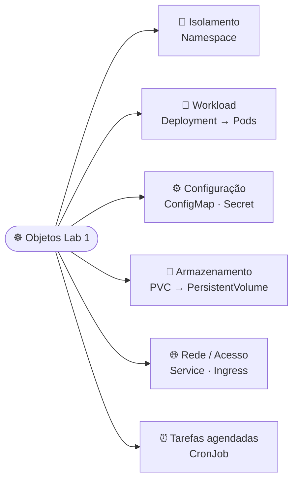
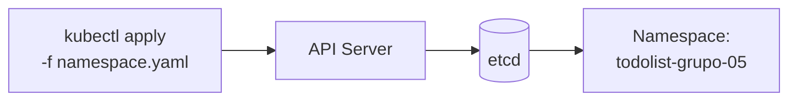
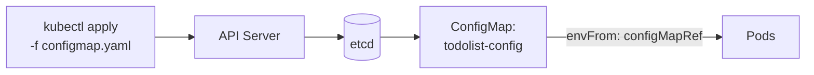
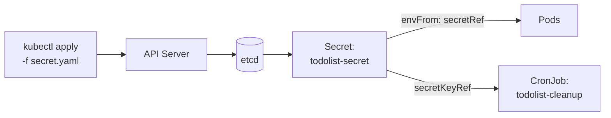
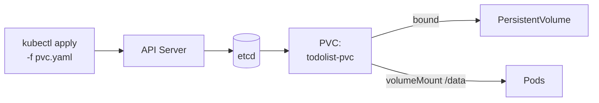
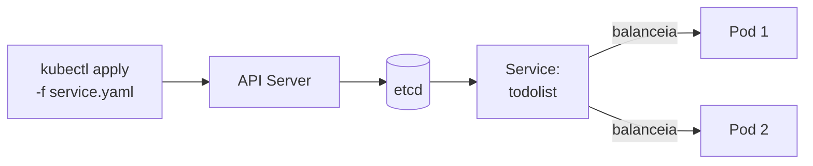
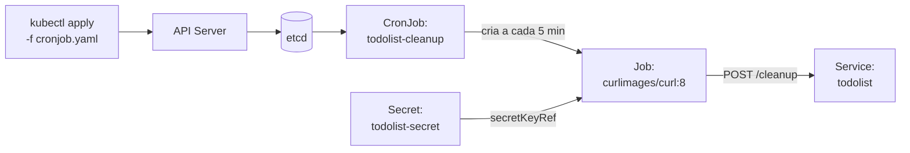
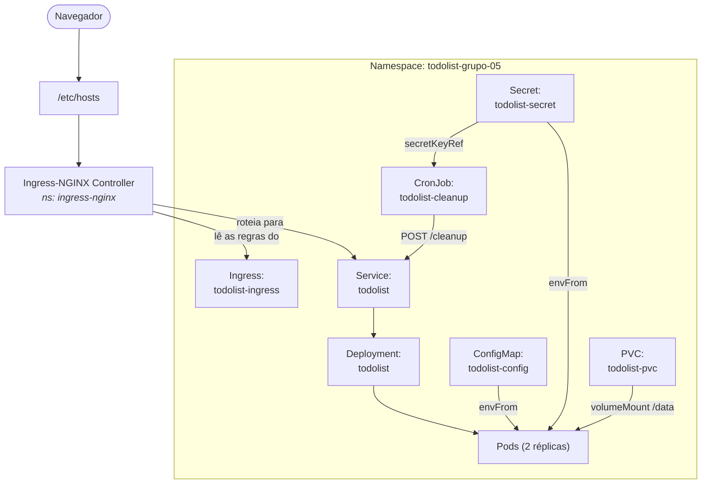

# CESAR School · Pós DevOps · Kubernetes

Repositório com os labs práticos do módulo de Orquestração de Containers com Kubernetes.

---

## Sumário

- [Conceitos: como o Kubernetes funciona](#conceitos-como-o-kubernetes-funciona)
- [Pré-requisitos](#pré-requisitos)
- [Preparando o cluster](#preparando-o-cluster)
- [Lab 1: Workloads + Acesso + Persistência](#lab-1-workloads--acesso--persistência)
  - [Subir tudo de uma vez](#subir-tudo-de-uma-vez)
  - [Como subir o ambiente](#como-subir-o-ambiente)
  - [Verificação](#verificação)
  - [Troubleshooting](#troubleshooting)
  - [Indo além (opcional)](#indo-além-opcional)
  - [Acesso via navegador](#acesso-via-navegador)
  - [Visão geral](#visão-geral-como-todos-os-recursos-se-conectam)
- [Lab 2](#lab-2-em-breve)
- [Créditos](#créditos)

## Conceitos: como o Kubernetes funciona

O Kubernetes é **declarativo**: descrevemos o *estado desejado* em manifests YAML.
O cluster trabalha continuamente para alcançá-lo.

Quem faz esse trabalho são os **controllers**, que operam num *reconciliation loop*.
Eles comparam o que existe com o que foi pedido e agem para convergir os dois.

O cluster se divide em **Control Plane** (decide o que deve acontecer)
e em **Worker Nodes** (onde os containers de fato rodam).

Vejamos o que acontece quando rodamos um `kubectl apply`:


| Componente | Papel |
| --- | --- |
| 🔵 **API Server** | Porta de entrada: valida e processa todas as requisições |
| 📦 **etcd** | Banco que guarda o estado desejado do cluster |
| ⚙️ **Controllers** | Reconciliam Deployment, ReplicaSet e Pods |
| 📅 **Scheduler** | Escolhe o melhor nó para cada Pod |
| 🔧 **Kubelet** | Executa as instruções no nó escolhido |
| 🐳 **Container Runtime** | Puxa a imagem e inicia o container |
| 🌐 **CNI Plugin** | Atribui IP ao Pod e configura a rede |
| ✅ **Pod Running** | Pod pronto para receber tráfego |

> **Reconciliation loop:** esse ciclo nunca para.
> Se um Pod cair, o controller percebe a diferença entre o estado atual e o desejado.
> Ele cria outro Pod para restaurá-lo, sem intervenção manual.

---

**Referências oficiais:**

- [Componentes do cluster: API Server, etcd, Scheduler e Kubelet][components]
- [Controllers / Reconciliation][controllers-reconciliation]
- [Pods][pods]

[components]: https://kubernetes.io/docs/concepts/overview/components/
[controllers-reconciliation]: https://kubernetes.io/docs/concepts/architecture/controller/
[pods]: https://kubernetes.io/docs/concepts/workloads/pods/

## Pré-requisitos

Ferramentas que precisam estar instaladas na sua máquina:

- [kind](https://kind.sigs.k8s.io/) — Sobe um cluster
  Kubernetes local dentro do Docker: `kind --version`
- [kubectl](https://kubernetes.io/docs/tasks/tools/) — Cliente de linha de
  comando do Kubernetes: `kubectl version --client`
- [Docker](https://docs.docker.com/get-docker/) — Runtime usado pelo kind (e
  para construir imagens locais, quando necessário): `docker --version`

O cluster e o Ingress Controller são criados na seção
[Preparando o cluster](#preparando-o-cluster).

## Preparando o cluster

Sobe o ambiente uma única vez — serve para qualquer lab deste repositório.

A configuração do cluster fica em [`kind-config.yaml`](kind-config.yaml), que
expõe as portas 80/443 no host e marca o node com `ingress-ready=true`
(necessário para o Ingress responder em `http://localhost`).

```bash
# 1) Criar o cluster kind a partir do arquivo de configuração:
kind create cluster --name k8s-labs --config kind-config.yaml

# 2) Instalar o Ingress-NGINX Controller (provider: kind):
kubectl apply -f https://raw.githubusercontent.com/kubernetes/ingress-nginx/main/deploy/static/provider/kind/deploy.yaml

# 3) Aguardar o Ingress Controller ficar pronto (evita erro de webhook):
kubectl wait --namespace ingress-nginx \
  --for=condition=ready pod \
  --selector=app.kubernetes.io/component=controller \
  --timeout=90s
```

## Lab 1: Workloads + Acesso + Persistência

Deploy completo do **TodoList** no cluster Kubernetes, cobrindo:
Namespace, ConfigMap, Secret, PVC, Deployment, Service, Ingress e CronJob.

### Objetos que criaremos neste lab

Cada objeto do Kubernetes tem um papel específico.
Criaremos oito objetos, agrupados aqui por função:



**Referências oficiais:**

- [Namespaces][namespaces]
- [Deployment][deployment]
- [ConfigMap][configmap]
- [Secret][secret]
- [PersistentVolume / PVC][pvc]
- [Service][service]
- [Ingress][ingress]
- [CronJob][cronjob]

[namespaces]: https://kubernetes.io/docs/concepts/overview/working-with-objects/namespaces/
[deployment]: https://kubernetes.io/docs/concepts/workloads/controllers/deployment/
[configmap]: https://kubernetes.io/docs/concepts/configuration/configmap/
[secret]: https://kubernetes.io/docs/concepts/configuration/secret/
[pvc]: https://kubernetes.io/docs/concepts/storage/persistent-volumes/
[service]: https://kubernetes.io/docs/concepts/services-networking/service/
[ingress]: https://kubernetes.io/docs/concepts/services-networking/ingress/
[cronjob]: https://kubernetes.io/docs/concepts/workloads/controllers/cron-jobs/

Nos passos a seguir, criaremos cada um desses objetos individualmente.
Ao final, há uma [visão geral](#visão-geral-como-todos-os-recursos-se-conectam)
de como todos se conectam em runtime.

### Estrutura dos manifests

```text
lab1/
├── namespace.yaml
├── configmap.yaml
├── secret.yaml
├── pvc.yaml
├── deployment.yaml
├── service.yaml
├── ingress.yaml
└── cronjob.yaml
```

### Subir tudo de uma vez

> Pressupõe o cluster e o Ingress já no ar — veja [Preparando o cluster](#preparando-o-cluster).

```bash
kubectl apply -f lab1/namespace.yaml
kubectl apply -f lab1/

kubectl get all -n todolist-grupo-05
```

### Como subir o ambiente

> Quer entender cada peça? Siga os passos abaixo, na ordem — cada um depende do
> anterior. (Já rodou o atalho acima? Então é só ler para entender o que foi criado.)

#### 1. Namespace

Isola todos os recursos do lab. Todo manifest abaixo deve declarar `namespace: todolist-grupo-05`.



```bash
kubectl apply -f lab1/namespace.yaml
```

---

#### 2. ConfigMap

Armazena variáveis não-sensíveis (`APP_NAME`, `APP_PORT`, `APP_COLOR`)
injetadas nos Pods via `envFrom`.



```bash
kubectl apply -f lab1/configmap.yaml
```

---

#### 3. Secret

Guarda `SESSION_KEY`, `ADMIN_USER`, `ADMIN_PASSWORD` e `CLEANUP_TOKEN`.
Funciona como o ConfigMap, mas é o objeto indicado para dados sensíveis:
os valores ficam codificados em base64 (apenas codificação, **não** criptografia)
e o acesso pode ser restringido via RBAC.



```bash
kubectl apply -f lab1/secret.yaml
```

---

#### 4. PersistentVolumeClaim

Solicita um volume de `500Mi` (`ReadWriteOnce`) ao cluster.
O Kubernetes provisiona o PersistentVolume e o vincula ao PVC.
O Deployment monta o volume em `/data`, onde fica o banco `todos.db`.

> No kind, o PVC só fica `Bound` quando um Pod o monta (passo 5) — até lá ele
> aparece como `Pending`, o que é normal. Veja [Troubleshooting](#troubleshooting).



```bash
kubectl apply -f lab1/pvc.yaml
```

---

#### 5. Deployment

Garante que **2 réplicas** da imagem
`andreffcastro/k8s-todolist:1.0.0` estejam sempre rodando.
Cada réplica consome o ConfigMap e o Secret via `envFrom` e monta o PVC em `/data`.

O Deployment Controller cria um ReplicaSet.
O ReplicaSet cria e mantém os Pods até ficarem prontos:


```bash
kubectl apply -f lab1/deployment.yaml
```

---

#### 6. Service

Expõe os Pods via `ClusterIP` estável na porta `80 → 5000`.
O `selector: app: todolist` balanceia entre as réplicas.



```bash
kubectl apply -f lab1/service.yaml
```

---

#### 7. Ingress

Recebe requisições externas em `todolist-grupo-05.local` e roteia para o Service.
Requer o Ingress-NGINX Controller instalado.


```bash
kubectl apply -f lab1/ingress.yaml
```

---

#### 8. CronJob

A cada 5 minutos (`*/5 * * * *`), um Job com a imagem `curlimages/curl:8`
faz `POST /cleanup` para limpar itens concluídos do banco.
O token vem diretamente do Secret.



```bash
kubectl apply -f lab1/cronjob.yaml
```

---

### Verificação

```bash
# ver visão geral dos recursos
kubectl get all -n todolist-grupo-05

# verificar PVCs, Ingress e CronJobs
kubectl get pvc,ingress,cronjob -n todolist-grupo-05

# verificar pods com mais detalhes
kubectl get pods -n todolist-grupo-05 -o wide
kubectl describe pod <POD_NAME> -n todolist-grupo-05

# logs dos pods (por label)
kubectl logs -l app=todolist -n todolist-grupo-05

# caso precise inspecionar o serviço localmente:
kubectl port-forward svc/todolist 5000:5000 -n todolist-grupo-05
```

### Troubleshooting

Coisas que costumam aparecer ao rodar este lab no `kind`:

- **`port is already allocated` ao criar o cluster?** Alguma coisa já usa a
  porta 80 ou 443 no host (IIS no Windows, outro servidor web, ou outro cluster
  kind). Libere a porta, ou troque o `hostPort` no
  [`kind-config.yaml`](kind-config.yaml) para portas altas (ex. `8080` e `8443`)
  e recrie o cluster — o acesso passa a ser `http://localhost:8080`.

- **PVC fica `Pending`?** É esperado. A StorageClass padrão do `kind`
  (`standard`) usa `WaitForFirstConsumer`: o volume só é provisionado quando
  o primeiro Pod monta o PVC. Assim que o Deployment sobe, ele passa para
  `Bound`. Você não precisa instalar nenhum provisioner — o `kind` já vem
  com o `local-path-provisioner` embutido.

- **Pod em `ImagePullBackOff`?** A imagem do lab (`andreffcastro/k8s-todolist:1.0.0`)
  é pública no Docker Hub — se esse erro aparecer com ela, verifique sua conexão.
  Para **imagens locais** (builds próprios), o `kind` não enxerga o registry local;
  carregue a imagem manualmente no cluster:

  ```bash
  docker build -t minha-imagem:tag .
  kind load docker-image minha-imagem:tag --name k8s-labs
  ```

### Indo além (opcional)

Tópicos fora do escopo deste lab, mas úteis quando for para um ambiente real:

- **Secrets seguros:** o Secret deste lab está versionado só para fins
  didáticos. Em projetos reais, **não comite valores sensíveis** (base64 é
  codificação, não criptografia). Crie o Secret fora do Git:

  ```bash
  kubectl create secret generic todolist-secret \
    --from-literal=ADMIN_USER=admin \
    --from-literal=ADMIN_PASSWORD='sua-senha' \
    --from-literal=SESSION_KEY='algum-valor' -n todolist-grupo-05
  ```

  Para gerenciar segredos versionáveis de forma segura, veja
  [SealedSecrets](https://github.com/bitnami-labs/sealed-secrets) ou
  [External Secrets](https://external-secrets.io/).

- **TLS no Ingress:** o lab usa HTTP simples. Para HTTPS local, use
  [`mkcert`](https://github.com/FiloSottile/mkcert) + um Secret TLS, ou
  [cert-manager](https://cert-manager.io/) com um issuer. (Let's Encrypt não
  emite certificado para `localhost`.)

- **Alternativas ao `/etc/hosts`:**
  - `kubectl port-forward svc/todolist 5000:5000 -n todolist-grupo-05`
    (acessa em `http://localhost:5000`, sem Ingress)
  - [`nip.io`](https://nip.io): use um host como
    `todolist-grupo-05.127.0.0.1.nip.io`, que resolve para `127.0.0.1`
    sem editar arquivo nenhum.

### Acesso via navegador

Vamos adicionar a entrada abaixo ao `/etc/hosts`:

```text
127.0.0.1 todolist-grupo-05.local
```

A aplicação fica acessível em: [http://todolist-grupo-05.local](http://todolist-grupo-05.local)

> **No WSL:** se você abre o site no navegador do **Windows**, quem vale é o
> hosts do Windows (`C:\Windows\System32\drivers\etc\hosts`) — não o `/etc/hosts`
> do WSL. O hosts do Windows é um arquivo comum e persiste normalmente. Já o
> `/etc/hosts` *de dentro do WSL* é regenerado a cada boot (apagando edições
> manuais), a menos que você desative isso com `generateHosts = false` no
> `/etc/wsl.conf`. Para evitar essa confusão, use o `nip.io`
> (`http://todolist-grupo-05.127.0.0.1.nip.io`), que resolve sozinho sem editar
> arquivo nenhum.

---

### Visão geral: como todos os recursos se conectam



---

## Lab 2: *em breve*

---

## Créditos

Disciplina ministrada pelo professor [@andreffcastro](https://github.com/andreffcastro).
Ele também é autor da imagem [`andreffcastro/k8s-todolist`](https://hub.docker.com/r/andreffcastro/k8s-todolist)
utilizada neste lab.
