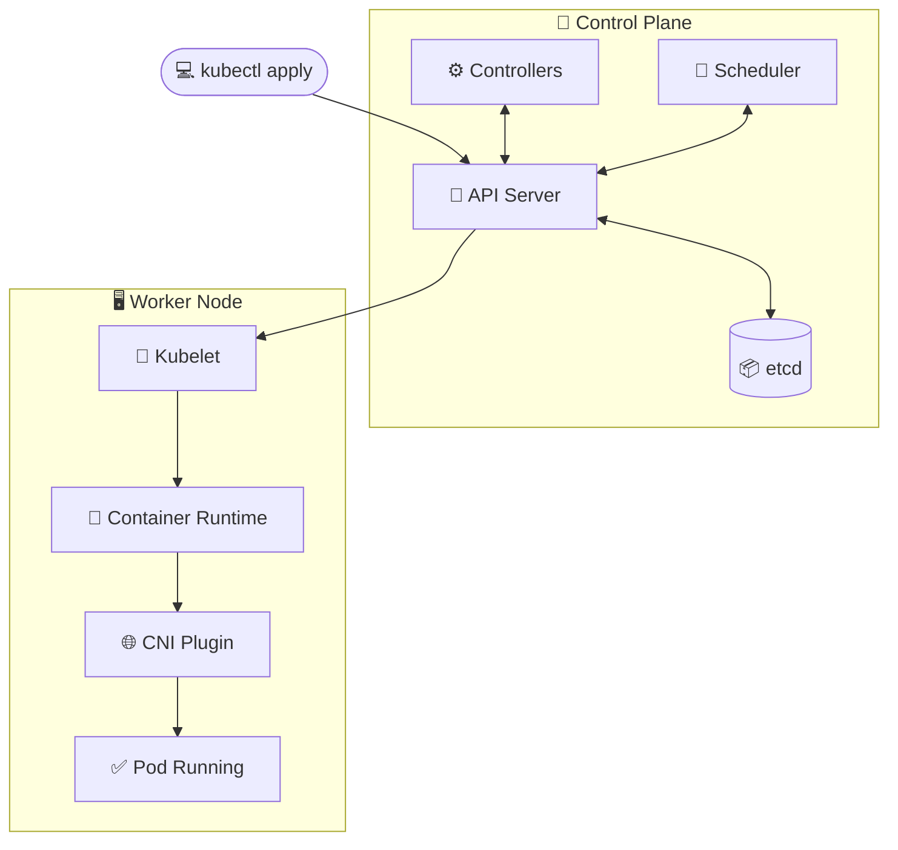
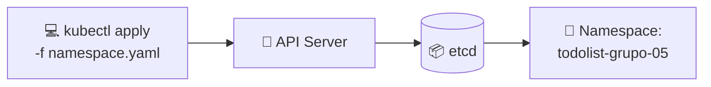
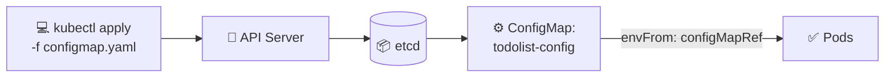
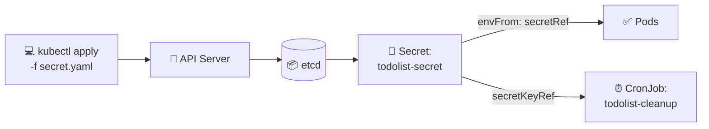
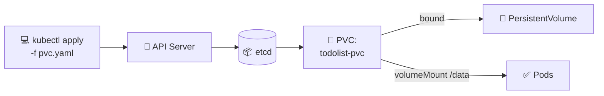
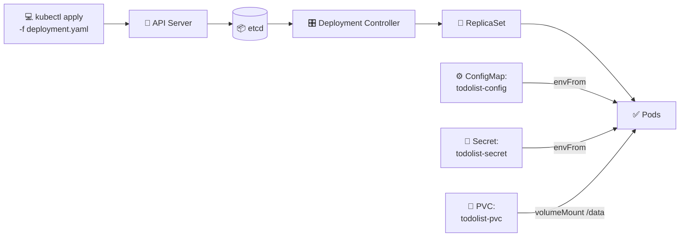
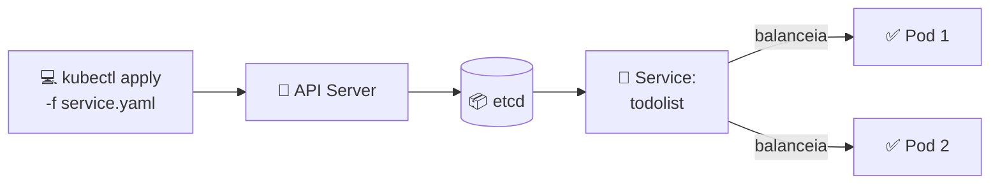
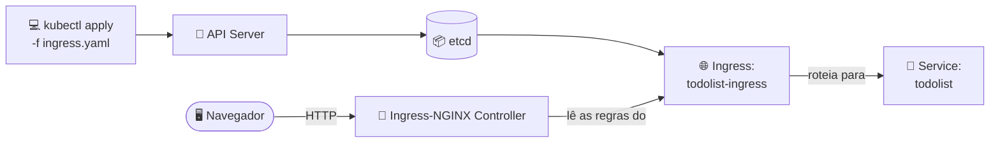
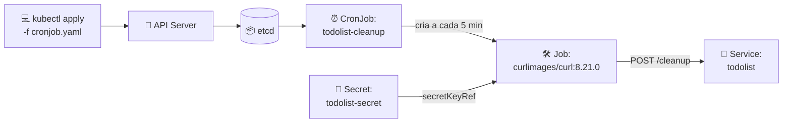
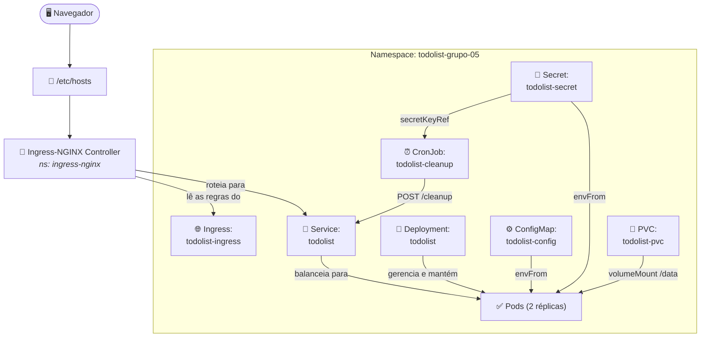

# CESAR School · Pós DevOps · Kubernetes

Repositório com os labs práticos do módulo de Orquestração de Containers com Kubernetes.


---

## Sumário

- [Conceitos: como o Kubernetes funciona](#conceitos-como-o-kubernetes-funciona)
- [Pré-requisitos](#pré-requisitos)
- [Preparando o cluster](#preparando-o-cluster)
- [Lab 1: Workloads + Acesso + Persistência](#lab-1-workloads--acesso--persistência)
  - [Como subir o ambiente](#como-subir-o-ambiente)
  - [Verificação](#verificação)
  - [Troubleshooting](#troubleshooting)
  - [Indo além (opcional)](#indo-além-opcional)
  - [Acesso via navegador](#acesso-via-navegador)
  - [Visão geral](#visão-geral-como-todos-os-recursos-se-conectam)
- [Lab 2](#lab-2-em-breve)
- [Créditos](#créditos)

## Conceitos: como o Kubernetes funciona

O Kubernetes é **declarativo**: descrevemos o *estado desejado* em manifests YAML.
O cluster trabalha continuamente para alcançá-lo.

Quem faz esse trabalho são os **controllers**, que operam num *reconciliation loop*.
Eles comparam o que existe com o que foi pedido e agem para convergir os dois.

O cluster se divide em **Control Plane** (decide o que deve acontecer)
e em **Worker Nodes** (onde os containers de fato rodam).

Vejamos o que acontece quando rodamos um `kubectl apply`:



| Componente | Papel |
| --- | --- |
| 🔵 **API Server** | Porta de entrada: valida e processa todas as requisições |
| 📦 **etcd** | Banco que guarda o estado desejado do cluster |
| ⚙️ **Controllers** | Reconciliam Deployment, ReplicaSet e Pods |
| 📅 **Scheduler** | Escolhe o melhor nó para cada Pod |
| 🔧 **Kubelet** | Executa as instruções no nó escolhido |
| 🐳 **Container Runtime** | Puxa a imagem e inicia o container |
| 🌐 **CNI Plugin** | Atribui IP ao Pod e configura a rede |
| ✅ **Pod Running** | Pod pronto para receber tráfego |

> [!NOTE]
> **Reconciliation loop:** esse ciclo nunca para.
> Se um Pod cair, o controller percebe a diferença entre o estado atual e o desejado.
> Ele cria outro Pod para restaurá-lo, sem intervenção manual.

---

**Referências oficiais:**

- [Componentes do cluster: API Server, etcd, Scheduler e Kubelet][components]
- [Controllers / Reconciliation][controllers-reconciliation]
- [Pods][pods]

[components]: https://kubernetes.io/docs/concepts/overview/components/
[controllers-reconciliation]: https://kubernetes.io/docs/concepts/architecture/controller/
[pods]: https://kubernetes.io/docs/concepts/workloads/pods/

## Pré-requisitos

Ferramentas que precisam estar instaladas na máquina:

- [kind](https://kind.sigs.k8s.io/): sobe um cluster Kubernetes local dentro
  do Docker. Confira a instalação com `kind --version`.
- [kubectl](https://kubernetes.io/docs/tasks/tools/): o cliente de linha de
  comando do Kubernetes. Confira com `kubectl version --client`.
- [Docker](https://docs.docker.com/get-docker/): o runtime que o kind usa (e
  que também serve para construir imagens locais quando necessário).
  Confira com `docker --version`.

O cluster e o Ingress Controller são criados na seção
[Preparando o cluster](#preparando-o-cluster).

## Preparando o cluster

Subimos o ambiente uma única vez; ele serve para qualquer lab deste repositório.

A configuração do cluster fica em [`kind-config.yaml`](kind-config.yaml), que
expõe as portas 80/443 no host e marca o node com `ingress-ready=true`
(necessário para o Ingress responder em `http://localhost`).

```bash
# 1) Criar o cluster kind a partir do arquivo de configuração:
kind create cluster --name k8s-labs --config kind-config.yaml

# 2) Instalar o Ingress-NGINX Controller (provider: kind):
kubectl apply -f https://raw.githubusercontent.com/kubernetes/ingress-nginx/controller-v1.12.1/deploy/static/provider/kind/deploy.yaml

# 3) Aguardar o Ingress Controller ficar pronto (evita erro de webhook):
kubectl wait --namespace ingress-nginx \
  --for=condition=ready pod \
  --selector=app.kubernetes.io/component=controller \
  --timeout=90s

# 4) Instalar o metrics-server (não usado no Lab 1; necessário para HPA e kubectl top):
kubectl apply -f https://github.com/kubernetes-sigs/metrics-server/releases/latest/download/components.yaml

# 5) No kind o kubelet usa certificado auto-assinado; desabilita a verificação TLS
#    (só para ambiente de laboratório, nunca em produção):
kubectl patch deployment metrics-server -n kube-system --type='json' \
  -p='[{"op":"add","path":"/spec/template/spec/containers/0/args/-","value":"--kubelet-insecure-tls"}]'

# 6) Aguardar o metrics-server reiniciar (evita "Metrics API not available" no kubectl top):
kubectl rollout status deployment metrics-server -n kube-system --timeout=90s
```

## Lab 1: Workloads + Acesso + Persistência

Deploy completo do **TodoList** no cluster Kubernetes, cobrindo:
Namespace, ConfigMap, Secret, PVC, Deployment, Service, Ingress e CronJob.

### Objetos que criaremos neste lab

Cada objeto do Kubernetes tem um papel específico.
Criaremos oito objetos, agrupados aqui por função:


**Referências oficiais:**

- [Namespaces][namespaces]
- [Deployment][deployment]
- [ConfigMap][configmap]
- [Secret][secret]
- [PersistentVolume / PVC][pvc]
- [Service][service]
- [Ingress][ingress]
- [CronJob][cronjob]

[namespaces]: https://kubernetes.io/docs/concepts/overview/working-with-objects/namespaces/
[deployment]: https://kubernetes.io/docs/concepts/workloads/controllers/deployment/
[configmap]: https://kubernetes.io/docs/concepts/configuration/configmap/
[secret]: https://kubernetes.io/docs/concepts/configuration/secret/
[pvc]: https://kubernetes.io/docs/concepts/storage/persistent-volumes/
[service]: https://kubernetes.io/docs/concepts/services-networking/service/
[ingress]: https://kubernetes.io/docs/concepts/services-networking/ingress/
[cronjob]: https://kubernetes.io/docs/concepts/workloads/controllers/cron-jobs/

Nos passos a seguir, criaremos cada um desses objetos individualmente.
Ao final, há uma [visão geral](#visão-geral-como-todos-os-recursos-se-conectam)
de como todos se conectam em runtime.

### Estrutura dos manifests

```text
lab1/
├── namespace.yaml
├── configmap.yaml
├── secret.yaml
├── pvc.yaml
├── deployment.yaml
├── service.yaml
├── ingress.yaml
└── cronjob.yaml
```

### Como subir o ambiente

Siga os passos abaixo na ordem, porque cada um depende do anterior. Cada bloco
é colapsável: clique para expandir o objeto que quiser ver.

> [!TIP]
> **Ponto de partida com `--dry-run=client`:** em cada passo, o comando
> `kubectl create ... --dry-run=client -o yaml` **não cria nada no cluster**.
> Ele apenas imprime um YAML de exemplo. A ideia é redirecionar para um arquivo
> (`> lab1/arquivo.yaml`), ajustar o que faltar e só então criar o recurso com
> `kubectl apply -f`. Assim ganhamos um esqueleto sem ferir a regra do lab,
> já que a criação continua **declarativa**.
>
> O que o `dry-run` gera é o **mínimo que o Kubernetes exige**. O quanto
> precisaremos editar o arquivo gerado varia de acordo com o tipo de objeto:
>
> - 🟢 **Prontos para uso (requerem apenas revisão):** Namespace, ConfigMap,
>   Secret, Service e Ingress. O comando gera a estrutura praticamente finalizada.
> - 🟡 **Estrutura básica (requerem customização):** Deployment e CronJob. O
>   comando gera apenas o esqueleto inicial. Precisaremos adicionar os
>   complementos essenciais no YAML (ex: `envFrom`, volumes em `/data` e porta
>   `5000` no Deployment; comando `curl` e `secretKeyRef` no CronJob).
> - 🔴 **Criação manual (sem comando `create`):** PVC (PersistentVolumeClaim).
>   Como o `kubectl` não possui um gerador nativo para PVCs, o manifesto precisa
>   ser escrito integralmente do zero.

<details>
<summary><b>1. Namespace</b> — isola todos os recursos do lab</summary>

Isola todos os recursos do lab. Todo manifest abaixo deve declarar `namespace: todolist-grupo-05`.



```bash
# Ponto de partida: gera o esqueleto do manifest
kubectl create namespace todolist-grupo-05 \
  --dry-run=client -o yaml > lab1/namespace.yaml

# Depois de revisar o arquivo, aplique:
kubectl apply -f lab1/namespace.yaml
```

</details>

<details>
<summary><b>2. ConfigMap</b> — variáveis não sensíveis (APP_NAME, APP_PORT, APP_COLOR)</summary>

Armazena variáveis não sensíveis (`APP_NAME`, `APP_PORT`, `APP_COLOR`)
injetadas nos Pods via `envFrom`.



```bash
# Ponto de partida: gera o esqueleto já com as chaves do lab
kubectl create configmap todolist-config \
  --from-literal=APP_NAME="TodoList - Grupo 05" \
  --from-literal=APP_PORT=5000 \
  --from-literal=APP_COLOR=purple \
  -n todolist-grupo-05 --dry-run=client -o yaml > lab1/configmap.yaml

# Depois de revisar o arquivo, aplique:
kubectl apply -f lab1/configmap.yaml
```

</details>

<details>
<summary><b>3. Secret</b> — dados sensíveis (sessão, login, token)</summary>

Guarda `SESSION_KEY`, `ADMIN_USER`, `ADMIN_PASSWORD` e `CLEANUP_TOKEN`.
Funciona como o ConfigMap, mas é o objeto indicado para dados sensíveis:
os valores ficam codificados em base64 (apenas codificação, **não** criptografia)
e o acesso pode ser restringido via RBAC.



```bash
# Ponto de partida: o create já codifica os valores em base64 no arquivo
kubectl create secret generic todolist-secret \
  --from-literal=SESSION_KEY=troque-este-valor \
  --from-literal=ADMIN_USER=admin \
  --from-literal=ADMIN_PASSWORD=troque-esta-senha \
  --from-literal=CLEANUP_TOKEN=troque-este-token \
  -n todolist-grupo-05 --dry-run=client -o yaml > lab1/secret.yaml

# Depois de revisar o arquivo, aplique:
kubectl apply -f lab1/secret.yaml
```

</details>

<details>
<summary><b>4. PersistentVolumeClaim</b> — volume de 500Mi para o banco</summary>

Solicita um volume de `500Mi` (`ReadWriteOnce`) ao cluster.
O Kubernetes provisiona o PersistentVolume e o vincula ao PVC.
O Deployment monta o volume em `/data`, onde fica o banco `todos.db`.

> 📝 **Nota:** no kind, o PVC só fica `Bound` quando um Pod o monta (passo 5). Até lá ele
> aparece como `Pending`, o que é normal. Veja [Troubleshooting](#troubleshooting).



> ❗ **Importante:** não há `kubectl create pvc`, então escreva `lab1/pvc.yaml` à mão com
> `kind: PersistentVolumeClaim`, `accessModes: [ReadWriteOnce]` e
> `resources.requests.storage: 500Mi`.

```bash
kubectl apply -f lab1/pvc.yaml
```

</details>

<details>
<summary><b>5. Deployment</b> — 2 réplicas do servidor TodoList</summary>

Garante que **2 réplicas** da imagem
`andreffcastro/k8s-todolist:1.0.0` estejam sempre rodando.
Cada réplica consome o ConfigMap e o Secret via `envFrom` e monta o PVC em `/data`.

O Deployment Controller cria um ReplicaSet.
O ReplicaSet cria e mantém os Pods até ficarem prontos:

> 📝 **Nota — imutabilidade de variáveis injetadas:** valores injetados via `envFrom`
> (ConfigMap e Secret) são lidos exclusivamente no momento da inicialização do
> container. Alterações feitas no ConfigMap ou no Secret não são refletidas
> automaticamente nos Pods em execução. Para aplicar novas configurações, é
> necessário forçar a recriação dos Pods com:
> `kubectl rollout restart deployment/todolist -n todolist-grupo-05`.



```bash
# Ponto de partida: gera só o esqueleto (imagem + réplicas)
kubectl create deployment todolist \
  --image=andreffcastro/k8s-todolist:1.0.0 --replicas=2 \
  -n todolist-grupo-05 --dry-run=client -o yaml > lab1/deployment.yaml

# Edite o arquivo para adicionar: envFrom (ConfigMap + Secret),
# containerPort 5000, volumeMounts em /data e o volume apontando para o PVC.
# Depois aplique:
kubectl apply -f lab1/deployment.yaml
```

</details>

<details>
<summary><b>6. Service</b> — expõe os Pods na porta 80 → 5000</summary>

Expõe os Pods via `ClusterIP` estável na porta `80 → 5000`.
O `selector: app: todolist` balanceia entre as réplicas.

> 📝 **Nota — Service vs Ingress (interno vs externo):** o Service fornece um endereço
> interno e estável para um conjunto de Pods (os IPs dos Pods mudam dinamicamente;
> o do Service é fixo). Como está definido como `ClusterIP`, ele só é acessível
> de dentro do cluster. Quem expõe essa aplicação para o navegador é o Ingress
> (passo 7).
>
> **Mapeamento de portas:** `port: 80` é a porta exposta pelo Service;
> `targetPort: 5000` é a porta onde a aplicação escuta dentro do Pod. O Service
> recebe o tráfego na porta 80 e o encaminha para a porta 5000 dos Pods
> selecionados.



```bash
# Ponto de partida: --tcp=80:5000 já define port 80 → targetPort 5000
kubectl create service clusterip todolist --tcp=80:5000 \
  -n todolist-grupo-05 --dry-run=client -o yaml > lab1/service.yaml

# Confira o selector (deve ser app: todolist) e aplique:
kubectl apply -f lab1/service.yaml
```

</details>

<details>
<summary><b>7. Ingress</b> — acesso externo via todolist-grupo-05.local</summary>

Recebe requisições externas em `todolist-grupo-05.local` e roteia para o Service.
Requer o Ingress-NGINX Controller instalado.

> ❗ **Importante — `ingressClassName`:** sem o campo `ingressClassName: nginx`,
> o Ingress Controller ignora o manifesto e nenhum roteamento é aplicado (isso
> ocorre porque, no kind, não existe uma classe marcada como default). Além
> disso, o roteamento é baseado em **host**: a regra definida só responde a
> requisições destinadas a `todolist-grupo-05.local`. Acessar por outros
> endereços (como `localhost`) resultará em um erro `404 Not Found` do NGINX,
> pois não haverá uma regra que corresponda ao host requisitado.



```bash
# Ponto de partida: --rule="host/path=service:port"
kubectl create ingress todolist-ingress \
  --rule="todolist-grupo-05.local/*=todolist:80" \
  -n todolist-grupo-05 --dry-run=client -o yaml > lab1/ingress.yaml

# Depois de revisar o arquivo, aplique:
kubectl apply -f lab1/ingress.yaml
```

</details>

<details>
<summary><b>8. CronJob</b> — limpeza automática a cada 5 minutos</summary>

A cada 5 minutos (`*/5 * * * *`), um Job com a imagem `curlimages/curl:8.21.0`
faz `POST /cleanup` para limpar itens concluídos do banco.
O token vem diretamente do Secret.

> ⚠️ **Atenção — dois pontos na configuração do CronJob:**
>
> - **Expansão de variáveis de ambiente:** o valor do `$CLEANUP_TOKEN` só é
>   expandido se o comando for executado dentro de um shell. Configure o comando
>   como `command: ["/bin/sh", "-c", "curl -H 'X-Cleanup-Token: $CLEANUP_TOKEN' ..."]`.
>   Se omitir o `/bin/sh -c`, o header será enviado como o texto literal
>   `$CLEANUP_TOKEN`, causando falhas de autenticação (`401` ou `403`).
> - **Política de reinicialização (`restartPolicy`):** Pods criados por
>   Jobs/CronJobs exigem `restartPolicy: OnFailure` ou `Never`. O valor padrão
>   (`Always`) é incompatível com o ciclo de vida de uma tarefa agendada e
>   resultará em erro ao aplicar o manifesto.
>
> 📝 **Nota — escopo das labels:** as labels `app`/`component` ficam apenas no
> objeto CronJob, não no Pod que ele cria. Se o Pod do `curl` tivesse
> `app: todolist`, o Service passaria a roteá-lo como se fosse um servidor web
> (que ele não é), enviando tráfego para um Pod que apenas executa uma tarefa e
> encerra.



```bash
# Ponto de partida: gera o esqueleto com imagem + agendamento
kubectl create cronjob todolist-cleanup \
  --image=curlimages/curl:8.21.0 --schedule="*/5 * * * *" \
  -n todolist-grupo-05 --dry-run=client -o yaml > lab1/cronjob.yaml

# Edite o arquivo para adicionar o command do curl (POST /cleanup) e o
# CLEANUP_TOKEN via secretKeyRef. Depois aplique:
kubectl apply -f lab1/cronjob.yaml
```

</details>

### Verificação

```bash
# ver visão geral dos recursos
kubectl get all -n todolist-grupo-05

# verificar PVCs, Ingress e CronJobs
kubectl get pvc,ingress,cronjob -n todolist-grupo-05

# verificar pods com mais detalhes
kubectl get pods -n todolist-grupo-05 -o wide
kubectl describe pod <POD_NAME> -n todolist-grupo-05

# logs dos pods (por label)
kubectl logs -l app=todolist -n todolist-grupo-05

# caso precise inspecionar o serviço localmente (5000 local -> 80 do Service):
kubectl port-forward svc/todolist 5000:80 -n todolist-grupo-05
```

### Troubleshooting

Problemas comuns e soluções ao executar o ambiente localmente com o `kind`:

- 🔴 **Erro de porta alocada (`port is already allocated`):**
  - **Causa:** outro serviço no host (como IIS no Windows, Apache, ou outro
    cluster kind) já está utilizando a porta 80 ou 443.
  - **Solução:** libere as portas parando o serviço conflitante, ou altere o
    parâmetro `hostPort` no arquivo [`kind-config.yaml`](kind-config.yaml) para
    portas altas (ex: `8080` e `8443`). Lembre-se de recriar o cluster e acessar
    a aplicação via `http://localhost:8080`.

- 🟡 **Volume preso no status `Pending` (PVC):**
  - **Causa:** comportamento esperado. A `StorageClass` padrão do kind utiliza o
    modo `WaitForFirstConsumer`.
  - **Solução:** nenhuma ação é necessária. O volume só será provisionado
    fisicamente quando o primeiro Pod tentar montá-lo. Assim que o Deployment
    subir, o status do PVC mudará automaticamente para `Bound`.

- 🔴 **Falha ao baixar imagem (`ImagePullBackOff`):**
  - **Causa 1 (Imagem Pública):** falha de conexão com a internet ou
    instabilidade no Docker Hub ao tentar baixar `andreffcastro/k8s-todolist:1.0.0`.
  - **Causa 2 (Imagem Local):** o cluster kind funciona isolado do sistema e
    não enxerga o *registry* local do Docker por padrão.
  - **Solução para imagens locais:** é necessário carregar a imagem construída
    manualmente para dentro do node do kind antes de aplicá-la:

    ```bash
    # Constrói a imagem localmente
    docker build -t minha-imagem:tag .

    # Injeta a imagem diretamente no cluster kind
    kind load docker-image minha-imagem:tag --name k8s-labs
    ```

### Indo além (opcional)

Tópicos fora do escopo deste lab, mas úteis quando for para um ambiente real:

- **Secrets seguros:** o Secret deste lab está versionado só para fins
  didáticos. Em projetos reais, **não versione valores sensíveis no repositório**
  (base64 é codificação, não criptografia). Crie o Secret fora do Git:

  ```bash
  kubectl create secret generic todolist-secret \
    --from-literal=ADMIN_USER=admin \
    --from-literal=ADMIN_PASSWORD='sua-senha' \
    --from-literal=SESSION_KEY='algum-valor' \
    --from-literal=CLEANUP_TOKEN='algum-token' -n todolist-grupo-05
  ```

  Para gerenciar segredos versionáveis de forma segura, veja
  [SealedSecrets](https://github.com/bitnami-labs/sealed-secrets) ou
  [External Secrets](https://external-secrets.io/).

- **TLS no Ingress:** o lab usa HTTP simples. Para HTTPS local, use
  [`mkcert`](https://github.com/FiloSottile/mkcert) + um Secret TLS, ou
  [cert-manager](https://cert-manager.io/) com um issuer. (Let's Encrypt não
  emite certificado para `localhost`.)

- **Alternativas ao `/etc/hosts`:**
  - `kubectl port-forward svc/todolist 5000:80 -n todolist-grupo-05`
    (acessa em `http://localhost:5000`, sem Ingress)
  - [`nip.io`](https://nip.io): use um host como
    `todolist-grupo-05.127.0.0.1.nip.io`, que resolve para `127.0.0.1`
    sem editar arquivo nenhum.

### Acesso via navegador

Vamos adicionar a entrada abaixo ao `/etc/hosts`:

```text
127.0.0.1 todolist-grupo-05.local
```

A aplicação fica acessível em: [http://todolist-grupo-05.local](http://todolist-grupo-05.local)

> [!WARNING]
> **No WSL:** ao abrir o site no navegador do **Windows**, o sistema prioriza o
> arquivo hosts do Windows (`C:\Windows\System32\drivers\etc\hosts`), e não o `/etc/hosts`
> do WSL. O hosts do Windows é um arquivo comum e persiste normalmente. Já o
> `/etc/hosts` *de dentro do WSL* é regenerado a cada boot (apagando edições
> manuais), a menos que isso seja desativado com `generateHosts = false` no
> `/etc/wsl.conf`. Para evitar essa confusão, use o `nip.io`
> (`http://todolist-grupo-05.127.0.0.1.nip.io`), que resolve sozinho sem editar
> arquivo nenhum.

---

### Visão geral: como todos os recursos se conectam



---

## Lab 2: *em breve*

---

## Créditos

Disciplina ministrada pelo professor [@andreffcastro](https://github.com/andreffcastro).
Ele também é autor da imagem [`andreffcastro/k8s-todolist`](https://hub.docker.com/r/andreffcastro/k8s-todolist)
utilizada neste lab.
