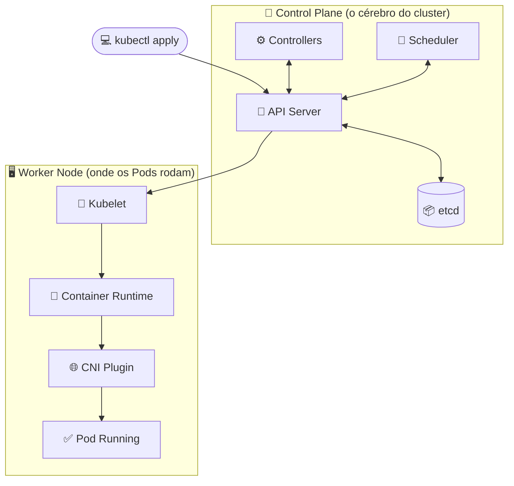
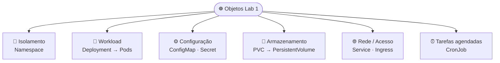
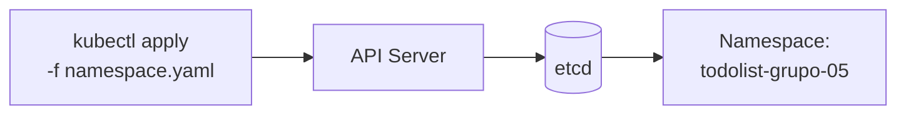
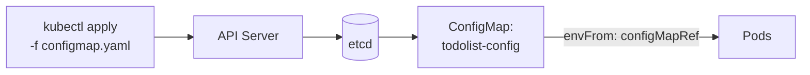
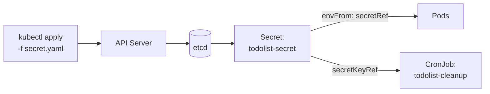
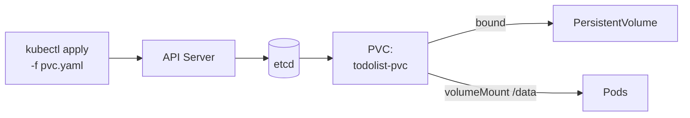
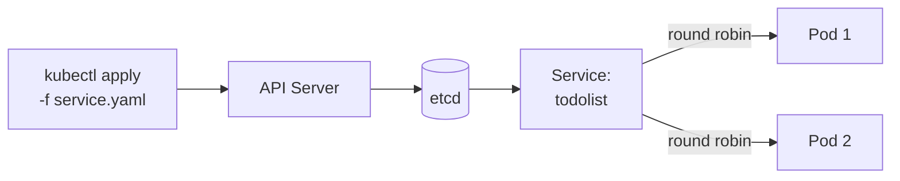
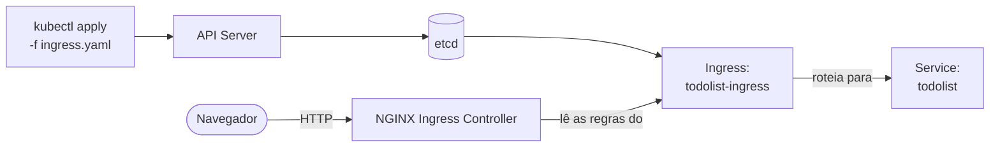
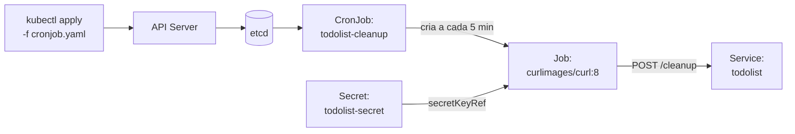
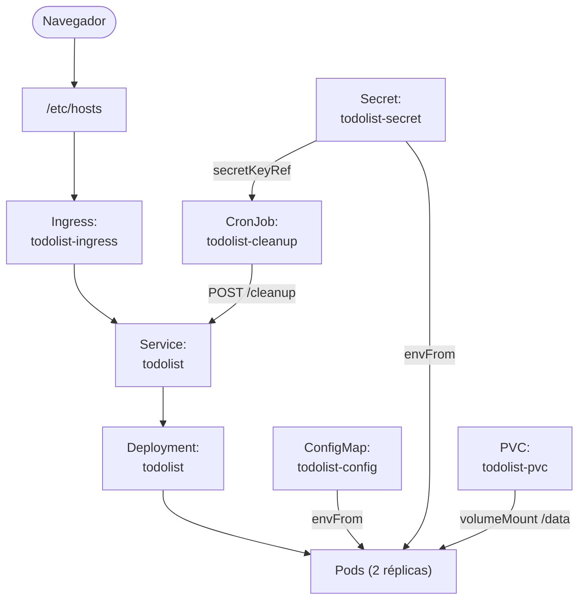

# CESAR School · Pós DevOps · Kubernetes

Repositório com os labs práticos do módulo de Orquestração de Containers com Kubernetes.

---

## Conceitos: como o Kubernetes funciona

O Kubernetes é **declarativo**: descrevemos o *estado desejado* em manifests YAML e o cluster trabalha continuamente para alcançá-lo. Quem faz esse trabalho são os **controllers**, que operam num *reconciliation loop*, comparando o que existe com o que foi pedido e agindo para convergir os dois.

O cluster se divide em **Control Plane** (decide o que deve acontecer) e **Worker Nodes** (onde os containers de fato rodam). Vejamos o que acontece quando rodamos um `kubectl apply`:



| Componente | Papel |
| --- | --- |
| 🔵 **API Server** | Porta de entrada: valida e processa todas as requisições |
| 📦 **etcd** | Banco que guarda o estado desejado do cluster |
| ⚙️ **Controllers** | Criam e reconciliam os recursos (Deployment → ReplicaSet → Pods) |
| 📅 **Scheduler** | Escolhe o melhor nó para cada Pod |
| 🔧 **Kubelet** | Executa as instruções no nó escolhido |
| 🐳 **Container Runtime** | Puxa a imagem e sobe o container (containerd / CRI-O) |
| 🌐 **CNI Plugin** | Atribui IP ao Pod e configura a rede |
| ✅ **Pod Running** | Pod pronto para receber tráfego |

> **Reconciliation loop:** esse ciclo nunca para. Se um Pod cair, o controller percebe a diferença entre o estado atual e o desejado e cria outro para restaurá-lo, sem intervenção manual.

---

## Lab 1: Workloads + Acesso + Persistência

Deploy completo do **TodoList** no cluster Kubernetes, cobrindo: Namespace, ConfigMap, Secret, PVC, Deployment, Service, Ingress e CronJob.

### Objetos que criaremos neste lab

Cada objeto do Kubernetes tem um papel específico. Criaremos oito, agrupados aqui por função:



Nos passos a seguir, criaremos cada um desses objetos individualmente. Ao final, há uma [visão geral](#visão-geral-como-todos-os-recursos-se-conectam) de como todos se conectam em runtime.

### Pré-requisitos

- Cluster [kind](https://kind.sigs.k8s.io/) rodando localmente
- NGINX Ingress Controller instalado no cluster
- `kubectl` configurado apontando para o cluster

### Estrutura dos manifests

```text
lab1/
├── namespace.yaml
├── configmap.yaml
├── secret.yaml
├── pvc.yaml
├── deployment.yaml
├── service.yaml
├── ingress.yaml
└── cronjob.yaml
```

### Como subir o ambiente

> Vamos aplicar os manifests na ordem abaixo. Cada passo depende do anterior.

#### 1. Namespace

Isola todos os recursos do lab. Todo manifest abaixo deve declarar `namespace: todolist-grupo-05`.



```bash
kubectl apply -f lab1/namespace.yaml
```

---

#### 2. ConfigMap

Armazena variáveis não-sensíveis (`APP_NAME`, `APP_PORT`, `APP_COLOR`) injetadas nos Pods via `envFrom`.



```bash
kubectl apply -f lab1/configmap.yaml
```

---

#### 3. Secret

Guarda `SESSION_KEY`, `ADMIN_USER`, `ADMIN_PASSWORD` e `CLEANUP_TOKEN`. Igual ao ConfigMap, mas os valores são codificados em base64 com restrições de acesso adicionais.



```bash
kubectl apply -f lab1/secret.yaml
```

---

#### 4. PersistentVolumeClaim

Solicita um volume de `500Mi` (`ReadWriteOnce`) ao cluster. O Kubernetes provisiona o PersistentVolume e o vincula ao PVC; o Deployment o monta em `/data`, onde fica o banco `todos.db`.



```bash
kubectl apply -f lab1/pvc.yaml
```

---

#### 5. Deployment

Garante que **2 réplicas** da imagem `andreffcastro/k8s-todolist:1.0.0` estejam sempre rodando, cada uma consumindo o ConfigMap e o Secret via `envFrom` e montando o PVC em `/data`.

O Deployment Controller cria um ReplicaSet, que cria e mantém os Pods até ficarem prontos:


```bash
kubectl apply -f lab1/deployment.yaml
```

---

#### 6. Service

Expõe os Pods via `ClusterIP` estável na porta `80 → 5000`, usando `selector: app: todolist` para balancear entre as réplicas.



```bash
kubectl apply -f lab1/service.yaml
```

---

#### 7. Ingress

Recebe requisições externas em `todolist-grupo-05.local` e roteia para o Service. Requer o NGINX Ingress Controller instalado.



```bash
kubectl apply -f lab1/ingress.yaml
```

---

#### 8. CronJob

A cada 5 minutos (`*/5 * * * *`), um Job com a imagem `curlimages/curl:8` faz `POST /cleanup`, limpando itens concluídos do banco. O token vem diretamente do Secret.



```bash
kubectl apply -f lab1/cronjob.yaml
```

---

### Verificação

```bash
kubectl get all -n todolist-grupo-05
kubectl get pvc,ingress,cronjob -n todolist-grupo-05
```

### Acesso via navegador

Vamos adicionar a entrada abaixo ao `/etc/hosts`:

```text
127.0.0.1 todolist-grupo-05.local
```

A aplicação fica acessível em: [http://todolist-grupo-05.local](http://todolist-grupo-05.local)

---

### Visão geral: como todos os recursos se conectam



---

## Lab 2: *em breve*

---

## Créditos

Disciplina ministrada pelo professor [@andreffcastro](https://github.com/andreffcastro), autor também da imagem [`andreffcastro/k8s-todolist`](https://hub.docker.com/r/andreffcastro/k8s-todolist) usada neste lab.
